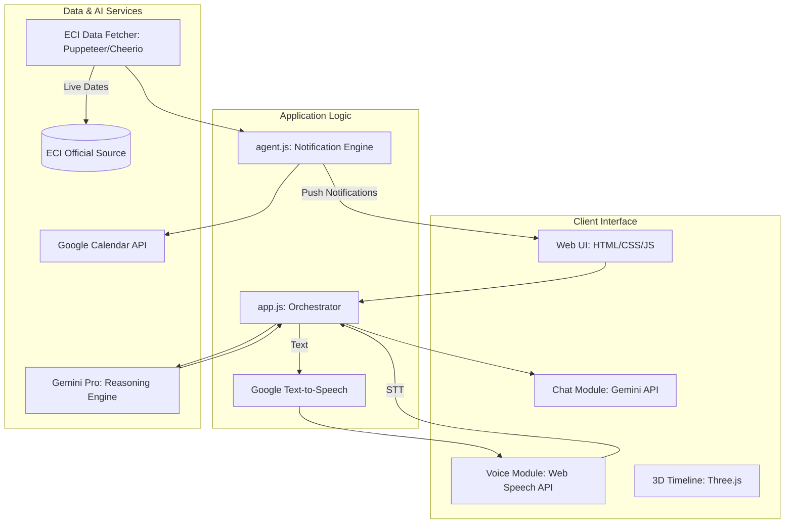

# VoiceVote: Agentic Indian Election Assistant

## Project Overview
**VoiceVote** is an advanced, AI-driven civic engagement platform designed to facilitate seamless interaction between Indian citizens and the electoral process. By leveraging large language models and real-time data from the Election Commission of India (ECI), the system provides a voice-first, agentic assistant capable of delivering accurate information, providing step-by-step guidance, and managing critical electoral timelines through automated reminders.

## System Architecture



## Key Features

### 1. Intelligent Voice Interface
The system utilizes the **Web Speech API** for real-time speech-to-text (STT) conversion and the **Google Text-to-Speech API** for high-fidelity audio responses. This ensures accessibility for users with varying levels of digital literacy or visual impairments.

### 2. Context-Aware Chat Assistant
Powered by the **Gemini API**, the chat interface provides grounded responses based on official ECI documentation. The assistant is programmed to act as a precise civic guide, handling complex queries regarding voter registration, documentation, and legislative procedures.

### 3. Agentic Notification System
VoiceVote functions as an autonomous agent by:
- **Real-time Synchronization:** Fetching live data from `eci.gov.in` and `voters.eci.gov.in`.
- **Automated Reminders:** Utilizing **Service Workers** and the **Web Push API** to deliver critical notifications 24 hours prior to registration deadlines and polling dates.
- **Calendar Integration:** Enabling users to synchronize electoral phases with their personal **Google Calendar**.

### 4. Interactive 3D Visualization
A high-performance **Three.js** implementation provides a 3D animated timeline of election phases. This visualization maps the temporal progression of the electoral process, allowing users to interact with specific nodes for detailed phase-specific information.

## Technical Specifications

| Component | Technology |
| :--- | :--- |
| **Frontend Engine** | Vanilla JavaScript / React |
| **AI Reasoning** | Google Gemini API (Pro) |
| **Voice Synthesis** | Google Cloud Text-to-Speech |
| **3D Rendering** | Three.js |
| **Data Acquisition** | Node.js (Puppeteer / Cheerio) |
| **Push Notifications** | Web Push API + Service Workers |
| **Storage** | LocalStorage / IndexedDB (Privacy-first) |

## Installation and Deployment

### Prerequisites
- Node.js (v18.0 or higher)
- Google Cloud Project with Gemini and TTS APIs enabled
- Modern browser supporting Web Speech and Push APIs

### Setup Instructions
1. **Clone the Repository:**
   ```bash
   git clone https://github.com/madhesh60/PromptWars_ElectionAssistant.git
   cd PromptWars_ElectionAssistant
   ```

2. **Configure Environment Variables:**
   Create a `.env` file in the root directory:
   ```env
   GEMINI_API_KEY=your_gemini_key
   GOOGLE_TTS_API_KEY=your_tts_key
   ```

3. **Install Dependencies:**
   ```bash
   npm install
   ```

4. **Execution:**
   For development mode:
   ```bash
   npm run dev
   ```

## Security and Compliance
- **Data Sovereignty:** All user interactions and reminder settings are stored locally within the user's browser environment. No PII (Personally Identifiable Information) is transmitted to external servers.
- **API Security:** Sensitive keys are managed via server-side environment variables and are never exposed to the client-side bundle.
- **Source Integrity:** Data is exclusively sourced from verified Election Commission of India (ECI) portals.

## Accessibility Statement
VoiceVote is engineered with inclusivity as a core principle. The multimodal interface (Voice, Text, and Visual) complies with WCAG 2.1 standards, ensuring that information is perceivable and operable for all citizens, regardless of physical or cognitive ability.

---
*Developed for the Google Antigravity Hackathon*
