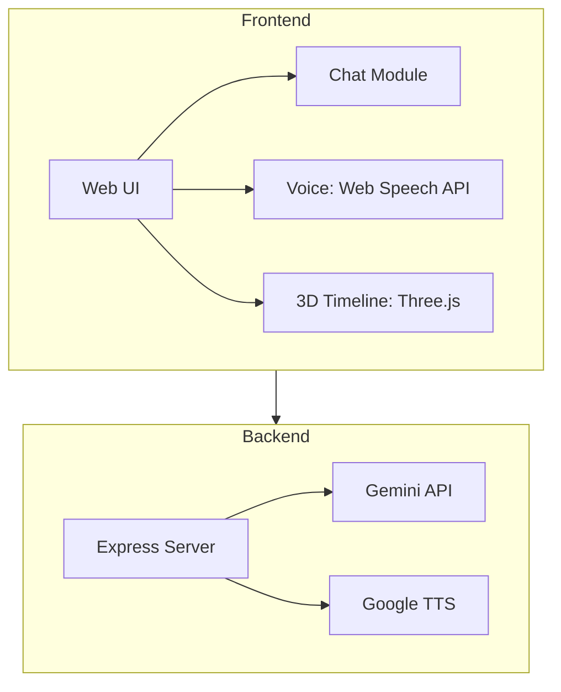

# Electo — AI Indian Election Assistant

**Electo** is an AI-driven civic engagement platform for Indian citizens. It delivers voice-first, agentic election assistance powered by Google Gemini, providing real-time information, bias detection, manifesto analysis, and constitutional law Q&A.

## Features

| Feature | Description |
|---|---|
| **AI Chat** | Gemini-powered Q&A on Indian elections |
| **Bias Detector** | Detects political lean in statements (Left / Center / Right) |
| **Manifesto Analyzer** | Parse party PDFs and extract promises |
| **Who Represents Me** | Find your MP/MLA by city or pincode |
| **Ask The Constitution** | Query Indian election laws & constitutional provisions |
| **3D Election Timeline** | Interactive Three.js visualization of election phases |
| **Agentic Reminders** | Push notifications for key electoral dates |

## Architecture



## Tech Stack

| Layer | Technology |
|---|---|
| Frontend | Vanilla JS / HTML / CSS |
| AI | Google Gemini API |
| Voice | Web Speech API + Google TTS |
| 3D | Three.js |
| Backend | Node.js + Express |
| Notifications | Web Push API + Service Workers |

## Setup

```bash
git clone https://github.com/madhesh60/Electo.git
cd Electo
npm install
cd backend && npm install
```

Create a `.env` file:
```env
GEMINI_API_KEY=your_gemini_key
GOOGLE_TTS_API_KEY=your_tts_key
```

Run:
```bash
npm run dev
```

---
*Built for the Google Antigravity PromptWars Hackathon*
